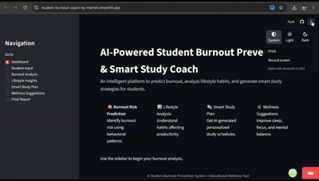

# 🧠 AI Student Burnout Coach

> An end-to-end machine learning web app that predicts student burnout risk, analyzes lifestyle habits, generates personalized study plans, and suggests wellness improvements — all in one place.

**Live Demo ->** [student-burnout-coach-by-manish.streamlit.app](https://student-burnout-coach-by-manish.streamlit.app/)

---



---

## Why I Built This

During exam season I kept noticing the same pattern around me - students pulling all-nighters, skipping meals, burning out - and still not performing well. The problem wasn't effort, it was the absence of any feedback loop that could tell a student *hey, you're heading toward burnout* before it's too late.

I wanted to build something practical: not a quiz, not a static article, but an actual system that takes your daily numbers - sleep, stress, screen time, physical activity - and gives you back something actionable. That's what this project is.

---

## What It Does

The app walks a student through seven sections:

| Section | What Happens |
|---|---|
| **Dashboard** | Overview of all features |
| **Student Input** | Student fills in lifestyle & study data via sliders |
| **Burnout Analysis** | Calculates a weighted burnout score + risk level (Low / Moderate / High) |
| **Lifestyle Insights** | Visualizes key stress factors using an interactive bar chart |
| **Smart Study Plan** | Generates a personalized daily study schedule based on risk level |
| **Wellness Suggestions** | Actionable lifestyle tips derived from input (sleep, water, exercise, etc.) |
| **Final Report** | Summarizes everything + downloadable `.txt` report |

---

## How the Burnout Score Works

The score is calculated using a weighted formula built on research-backed behavioral indicators:

```
burnout_score =
    (stress × 2.5) +
    (exam_pressure × 2.0) +
    (assignment_load × 1.8) +
    (screen_time × 1.5) −
    (sleep × 1.7) −
    (physical_activity × 1.5) −
    (breaks × 1.2)
```

Risk is then classified:
- **Low** → score < 15
- **Moderate** → 15–25
- **High** → > 25

The ML model (`RandomForestRegressor`) was trained on a real student survey dataset with features like fatigue frequency, sleep hours, academic stress levels, and device usage before sleep. The model achieved a low MSE on the held-out test set.

---

## Tech Stack

| Layer | Tools |
|---|---|
| Frontend / UI | Streamlit |
| ML Model | scikit-learn (RandomForestRegressor) |
| Data Processing | pandas, numpy |
| Visualization | Plotly Express |
| Model Persistence | joblib |
| Deployment | Streamlit Community Cloud |

---

## Project Structure

```
student-burnout-coach/
│
├── app.py                  # Main Streamlit application
├── train_model.py          # Model training script
├── student_dataset.csv     # Survey dataset used for training
├── requirements.txt        # Python dependencies
├── demo.gif                # App walkthrough (shown above)
│
└── model/
    └── burnout_model.pkl   # Trained Random Forest model
```

---

## Running Locally

```bash
# 1. Clone the repo
git clone https://github.com/manishkrmahato/student-burnout-coach.git
cd student-burnout-coach

# 2. Install dependencies
pip install -r requirements.txt

# 3. (Optional) Retrain the model
python train_model.py

# 4. Launch the app
streamlit run app.py
```

The app will open at `http://localhost:8501`

---

## Dataset

The training data (`student_dataset.csv`) is a survey-based dataset capturing student behavioral patterns — sleep quality, stress levels, fatigue frequency, academic workload, and electronic device usage habits. Categorical columns were label-encoded before training. Rows with missing values were dropped.

Key features used for the burnout score:
- Average daily sleep hours
- Daytime fatigue frequency
- Academic stress level
- Electronic device usage before sleep

---

## Sample Output

After filling in your data, the app gives you:

- A **numeric burnout score** with a progress bar showing severity
- A **risk label** — Low, Moderate, or High
- A **bar chart** breaking down your top stress contributors
- A **day schedule** tailored to your risk level
- **Specific lifestyle tips** (e.g., "Increase daily water intake", "Practice breathing exercises")
- A **downloadable report** you can save or share

---

## What I'd Improve Next

- Replace the rule-based study planner with an LLM-powered one (GPT / Claude API)
- Add historical tracking so students can monitor their burnout trend over time
- Incorporate a mood journaling feature
- Deploy with user authentication so data persists across sessions

---

## Author

**Manish Kumar Mahato**
B.Tech — Artificial Intelligence & Data Science, NIT Warangal (2024–2028)

[GitHub](https://github.com/manishkrmahato) · [LinkedIn](https://linkedin.com/in/manishkrmahato)

---

*This tool is meant for educational and self-awareness purposes only. It is not a clinical diagnostic tool.*
